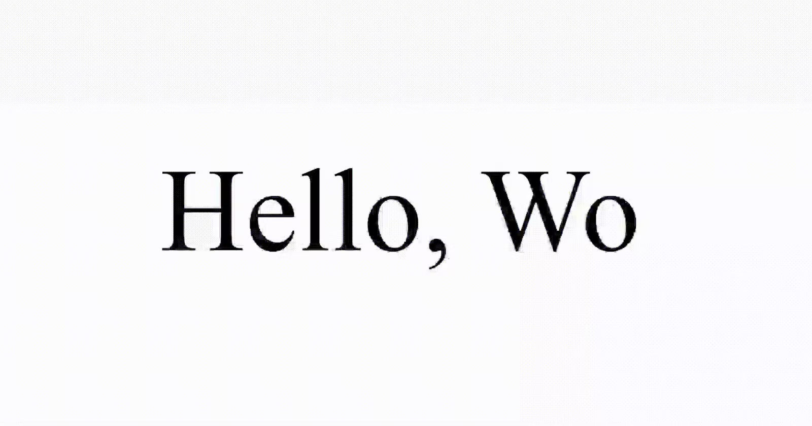

# React Typewriter Component

The React Typewriter component is a customizable and animated typing effect for your text. It emulates the classic typewriter style with options for speed, cursor appearance, and more.

## Author

[Pulkit](https://www.devpulkit.in/)

## Installation

You can install the Typewriter component via npm:

```
npm i react-custom-typewriter
```

## Usage

Import the component in your React application:

```
import Typewriter from 'react-custom-typewriter';

const App = () => {
  return (
    <Typewriter
      text="Hello, World!"
      speed={5}
      cursor={true}
      blinkRate={3}
      cursorChar="|"
      color="black"
      size="20"
      onComplete={() => console.log('Typing complete!')}
      hideOnComplete
    />
  );
};
```



## Props

- `text`: The text to be typed.
- `speed`: Typing speed, a number between 1 and 10.
- `cursor`: Show or hide the blinking cursor.
- `blinkRate`: Blinking rate of the cursor, a number between 1 and 10.
- `cursorChar`: The character to be used as the cursor.
- `color`: Text color.
- `size`: Font size.
- `onComplete`: Callback function triggered when typing is complete.
- `loop`: Enable or disable looping of the typing animation.
- `pauseOnHover`: Pause typing when the component is hovered.

## Examples

```
<Typewriter text="Hello, World!" speed={5} cursor={true} />
<Typewriter text="Customize me!" speed={8} cursor={false} color="blue" size="24" />
<Typewriter text="Looping animation" speed={5} cursor={true} loop={true} />
<Typewriter text="Pause on Hover" speed={5} cursor={true} pauseOnHover={true} />
```

Explore different configurations to bring your text to life!

Feel free to enhance and customize the README based on any additional features or information you want to provide.
